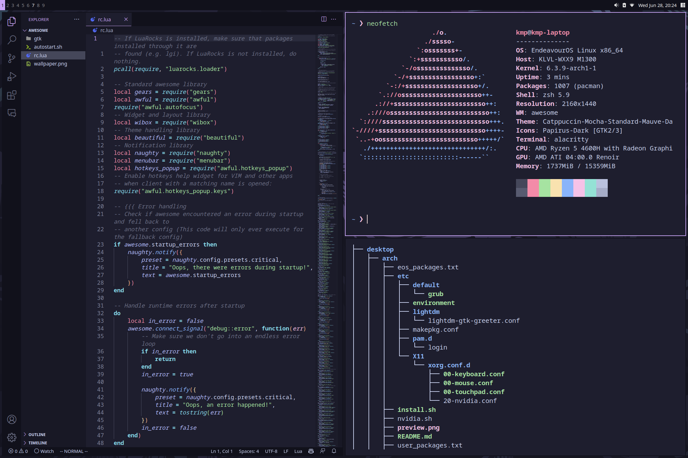

<h1 align="center"> 
    <samp>dotfiles</samp>
</h1>

    

<h2>
    <samp>Overview</samp>
</h2>

- **Operating System:** [EndeavourOS](https://endeavouros.com/)
- **Window Manager:** [awesomewm](https://awesomewm.org/)
- **Terminal:** [alacritty](https://alacritty.org/)
- **Shell:** [ZSH](https://www.zsh.org/) with [Oh My ZSH](https://ohmyz.sh/) and [Powerlevel10k](https://github.com/romkatv/powerlevel10k)
- **Editor:** [VSCode](https://code.visualstudio.com/)
- **Panel:** [wibar](https://awesomewm.org/doc/api/classes/awful.wibar.html)
- **Color scheme:** [catppuccin](https://github.com/catppuccin/catppuccin)
- **Application Launcher:** [rofi](https://github.com/davatorium/rofi)
- **Fetch:** [neofetch](https://github.com/dylanaraps/neofetch)
